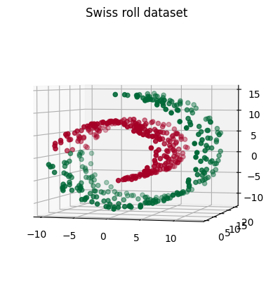
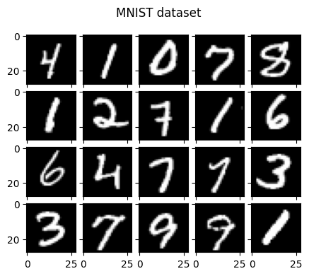
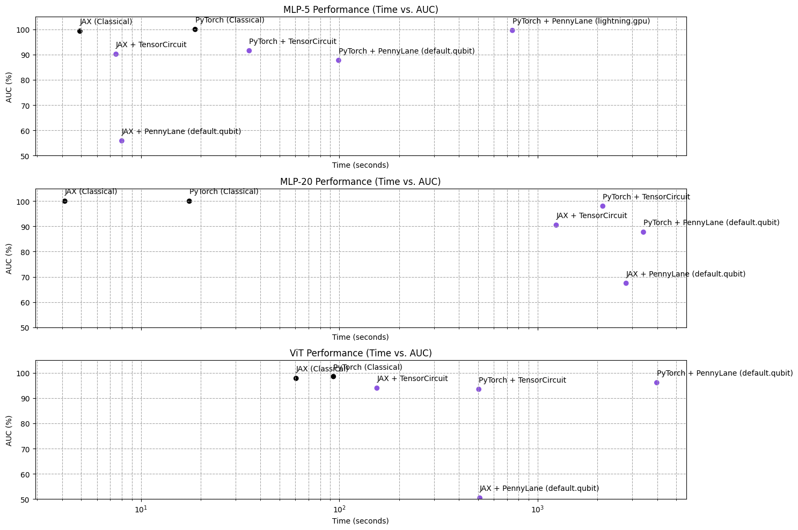

# Performance Comparison of Quantum Machine Learning Frameworks

The [PennyLane](https://pennylane.ai/) and [TensorCircuit](https://tensorcircuit.readthedocs.io/) quantum machine learning frameworks were evaluated by using the [PyTorch](https://pytorch.org/) and [JAX](https://jax.readthedocs.io/en/latest/) backends available in both backends. For PennyLane we used the `default.qubit` device, and the [`lightning.gpu`](https://docs.pennylane.ai/projects/lightning-gpu/en/latest/) device (only for PyTorch, as [batching is not supported with the JAX backend](https://discuss.pennylane.ai/t/incompatible-function-arguments-error-on-lightning-qubit-with-jax/2900)). We also unsuccessfully tried to evaluate [PennyLane Catalyst](https://docs.pennylane.ai/projects/catalyst/en/latest/), but it was not possible as it requires to use the JAX backend with the [`lightning.qubit`](https://docs.pennylane.ai/projects/lightning/en/stable/) device, which neither supports batching.

In the future, we want to also evaluate the performance on multi-GPU. We might also compare without batching to evaluate PennyLane Catalyst, and with other quantum devices such as Qulacs, and with other frameworks such as [Tensorflow Quantum](https://www.tensorflow.org/quantum), [Paddle Quantum](https://qml.baidu.com), [Qiskit](https://qiskit.org/ecosystem/machine-learning), [torchquantum](https://github.com/mit-han-lab/torchquantum), or others.Contributions are welcome!

## Benchmarks

The evaluations are done on a *Swiss roll* tabular dataset (3 features, 2 classes), with 400 examples for training and 100 for testing, and on the MNIST digits dataset, with 60000 examples for training and 10000 for testing.

 

For the Swiss roll dataset two multi-layer perceptrons (MLP) with different hidden sizes are used. Both have 3 layers: $3 \rightarrow H, H \rightarrow H, H \rightarrow 1$, with the first and last layers being classical, and the middle one being quantum (minus in the classical baselines). The hidden size $H$ is either 5 or 20. The first two layers have ReLU activations and the last one a sigmoid to use binary cross-entropy loss. The MLPs are trained for 50 epochs with the Adam optimizer and a learning rate of 0.001 and batch size of 4.

For the MNIST dataset, a Vision Transformer (ViT) is used. The ViT uses a patch size of 14x14 (the input images are 28x28), and 4 transformer blocks with a hidden size of 6, 2 attention heads, and a feed-forward hidden size of 3. The ViT is trained for 10 epochs with the Adam optimizer and a learning rate of 0.0003 and batch size of 64. The Quantum ViT uses the same architecture, but with the linear layers in the multi-head attention replaced by quantum layers, and with an added quantum layer in the feed-forward networks. This quantum architecture is based on the one used in [Di Sipio et al. "The Dawn of Quantum Natural Processing" (2022)](https://doi.org/10.1109/ICASSP43922.2022.9747675).

In all the cases the quantum layers consist of a circuit of $H$ qubits, which first encodes the classical features with a RX rotation of each qubit (in PennyLane, `qml.AngleEmbedding`) and then applies a paramatrized RX rotation on each qubit followed by a closed chain of CNOTs (in PennyLane, `qml.BasicEntanglerLayers`).

All the models are trained and evaluated on a single NVIDIA A100 80GB GPU on the NERSC Perlmutter supercomputer.

## Results

The training time indicated is the total time for training the model for all the epochs. The reported AUC is the highest AUC achieved on the test set during training.

The obtained results are the following:

The "PyTorch + PennyLane (lightning.gpu)" case was stopped for the MLP-20 and ViT benchmarks as they were taking too long (the expected training times were approximately 3 and 3398 hours (~5 months), respectively).
